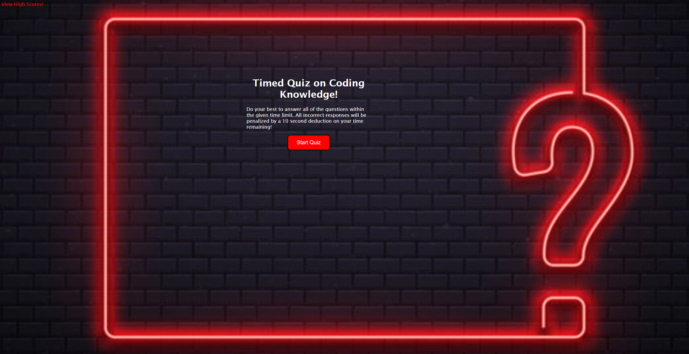
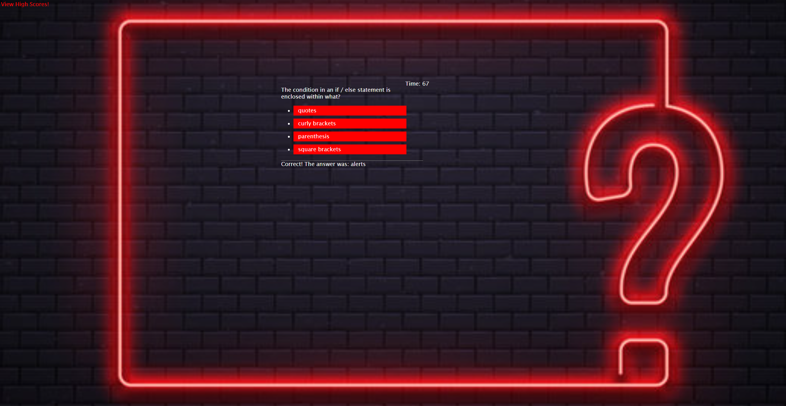
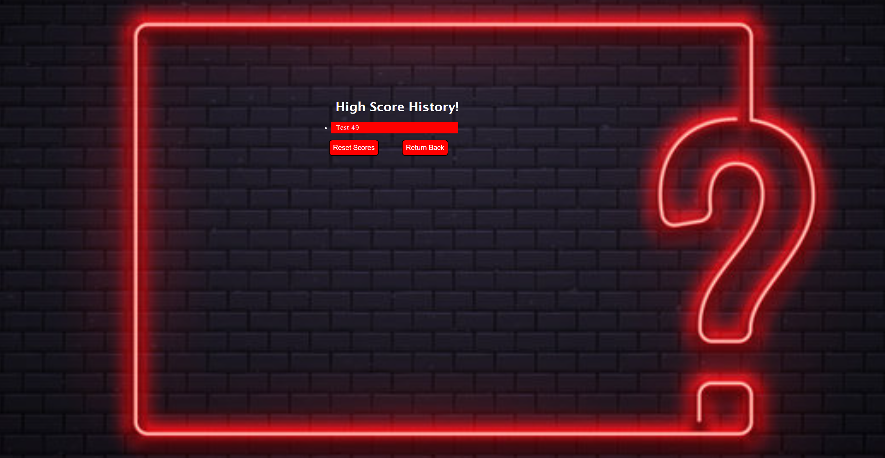
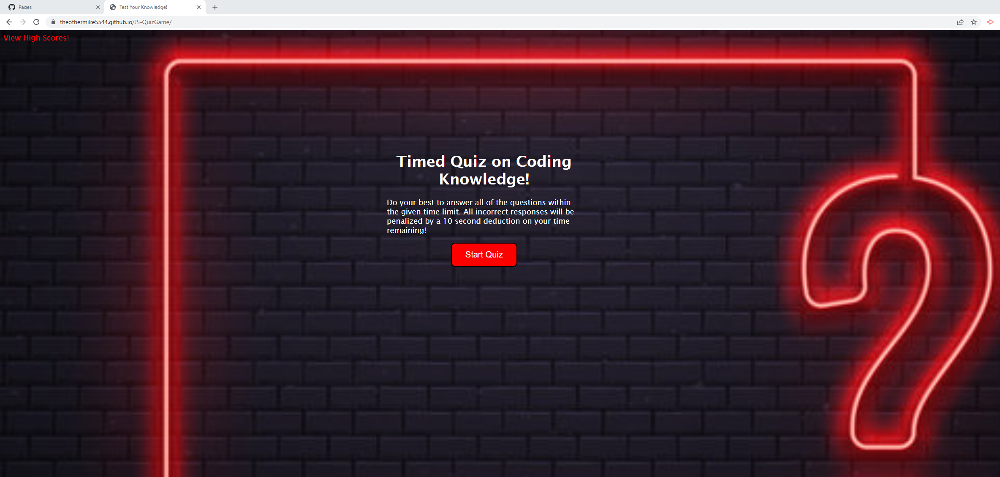

## JS-QuizGame
The purpose of this project was to further employ the use of previously learned basic HTML code along with CSS styling to serve as a shell for the implementation of newly learned JavaScript to display a functioning and working quiz game. The quiz game challenges players on 5 basic JavaScript questions, tracks the answers, counts down the time, penalizing players on time remaining for wrong answers, and ultimately assigns a score. Players can then submit their name/initials and score to a history page for tracking the high score. The page is interactive with buttons, starting, resetting, inputting, etc... Later on, I will expand this project on my own time to make it mobile responsive and add more questions for quiz practice to all new coders.

## Use Case
AS A coding boot camp student   
I WANT to take a timed quiz on JavaScript fundamentals that stores high scores   
SO THAT I can gauge my progress compared to my peers   

## Acceptance Criteria
GIVEN I am taking a code quiz   
WHEN I click the start button   
THEN a timer starts and I am presented with a question   
WHEN I answer a question   
THEN I am presented with another question   
WHEN I answer a question incorrectly   
THEN time is subtracted from the clock   
WHEN all questions are answered or the timer reaches 0   
THEN the game is over   
WHEN the game is over   
THEN I can save my initials and score   

## Screenshot of Quiz
   
   
   
## Screenshot of Live Quiz
   

## Live URL
https://theothermike5544.github.io/JS-QuizGame/

## GitHub Repo URL
https://github.com/Theothermike5544?tab=repositories